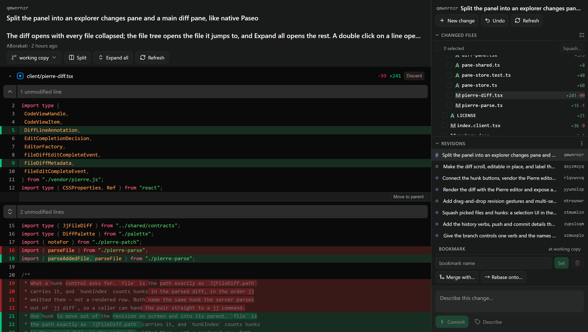
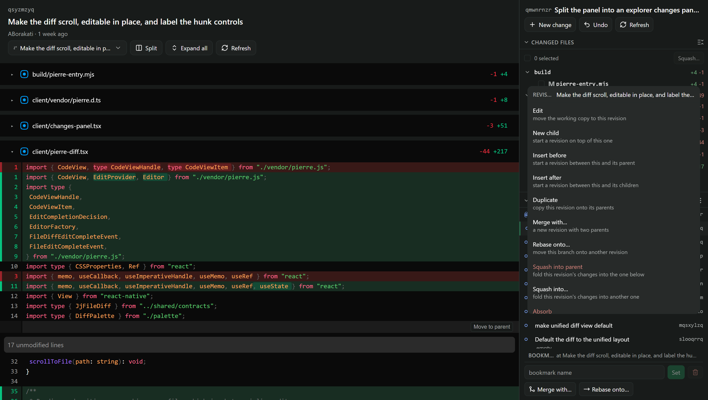
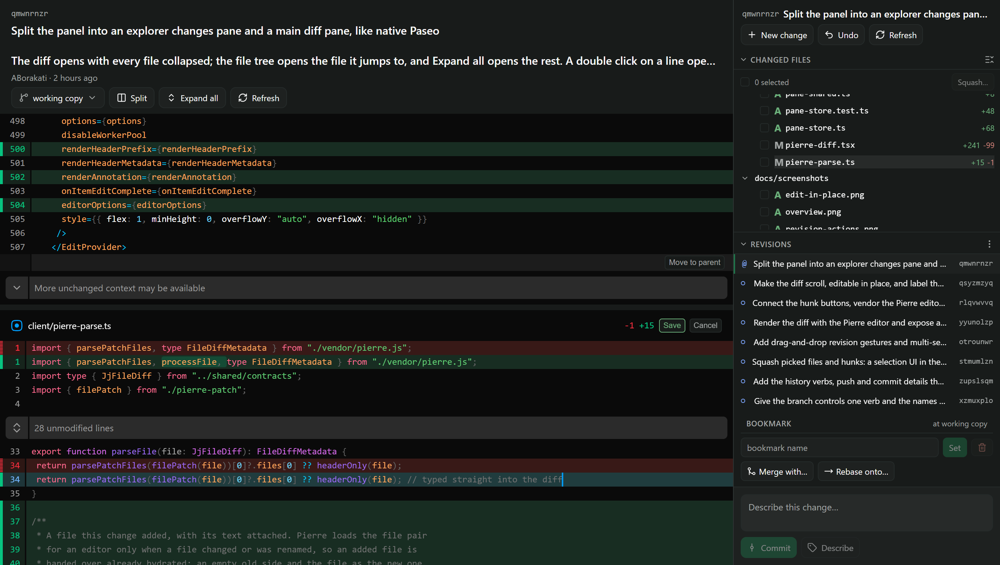
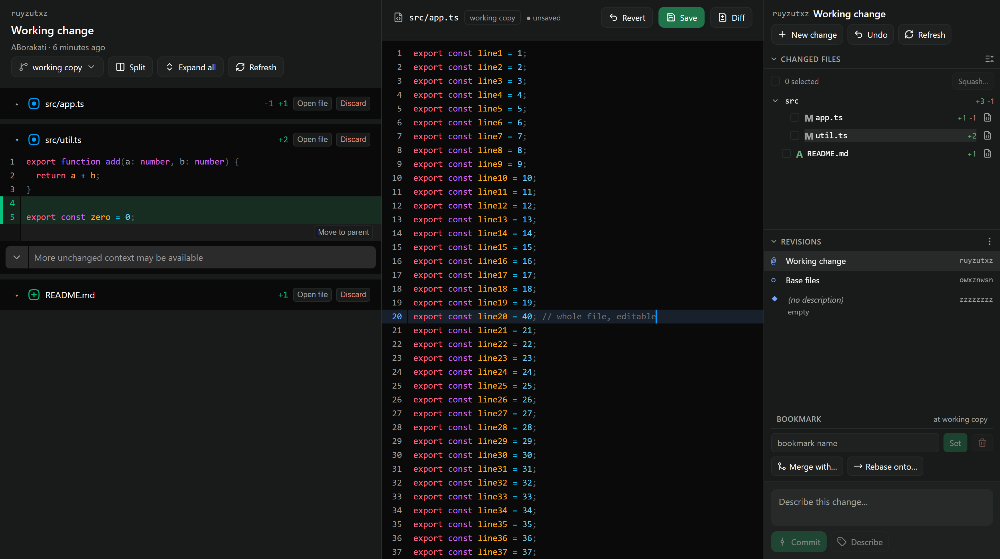

# paseo-jj

A [Jujutsu (jj)](https://jj-vcs.dev) version-control panel for [Paseo](https://paseo.sh). It follows Paseo's own
git view: a **jj changes** pane in the explorer rail, and a **jj diff** tab in the main area that you can edit in
place.



## Features

- **Changes pane** (explorer rail): changed files as a tree with `+/-` counts, the revision list with bookmarks and
  tags, a bookmark bar, and a composer that describes or commits the working copy.
- **Diff tab** (main area): Pierre diffs, unified or split, with syntax highlighting. Files start collapsed; the tree
  opens the file you click, and **Expand all** opens the rest.
- **Edit in place**: double-click a line to open that file's editor with the caret on the line. Save writes the file
  back to the working copy. A save is refused if the file changed on disk after you opened it, so an agent's edit is
  never overwritten.
- **Full file tab**: **Open file** in a diff header, or the file icon on a changed-file row, opens the whole file in a
  **jj file** tab at the revision you are looking at. Working-copy files are editable there: **Save** (or
  Ctrl/Cmd+S) writes through the same guard, **Revert** drops unsaved edits, and opening another file with unsaved
  edits asks first. Files at other revisions are read-only. **Diff** jumps back to the file's diff.
- **Per-hunk control**: **Move to parent** under each hunk moves just that hunk out of the revision and into its
  parent.
- **History verbs** from the revision menu: edit, new child, insert before/after, duplicate, merge, rebase (branch
  or single revision), squash into parent or into another revision, absorb, abandon, advance/set/delete bookmarks
  and push. **Undo** reverts the last jj operation.
- **Drag and drop** in the revision list: drop a revision on another to rebase it. Hold `R`, `S`, `D` or `M` while
  dropping to rebase one revision, squash, duplicate or merge (the same keys as
  [jj-view](https://github.com/brychanrobot/jj-view)).
- **Selections**: check files to squash them elsewhere; ctrl/cmd-click revisions to abandon, squash or rebase several
  at once.







## Requirements

- Paseo **0.8.0 or later** (`requirements.paseo` is `>=0.8.0`).
- [`jj`](https://jj-vcs.dev) on the `PATH` of the machine that runs the Paseo daemon.
- Node.js and npm on that machine: installing the plugin runs `npm ci` and bundles the Pierre diff editor.

## Install

```sh
paseo plugin install https://github.com/ABorakati/paseo-jj
```

Paseo plugins are trusted and run unsandboxed, so review the code before you install it. Then open **jj changes**
from the command center; clicking a file or a revision opens **jj diff**.

Update later with `paseo plugin update jj`.

## Git repositories

jj works on top of git, and this panel works in any jj workspace, including a colocated one (`.jj` and `.git` side
by side), where git sees every jj commit. In a plain git repository, the panel shows the command that adopts it:

```sh
jj git init --colocate
```

In a colocated repository, git's `HEAD` points at the working copy's parent, and git reports no current branch.
Point a bookmark at a commit and push it (**Push bookmark** in the revision menu) to publish it as a git branch.

## Development

```sh
npm ci --include=dev
npm run build:pierre      # bundles @pierre/diffs into client/vendor/pierre.js
npm run typecheck
npm test                  # unit tests
npm run test:integration  # runs jj in temporary repositories
paseo plugin install .    # install this checkout; after edits: paseo plugin reload jj
```

`client/vendor/pierre.js` is generated and ignored: Paseo compiles a plugin's own imports but cannot resolve Pierre's
transitive dependencies, so `build/vendor-pierre.mjs` bundles it into one local file. Run `npm run build:pierre`
after changing `@pierre/diffs` or `build/pierre-entry.mjs`.

Layout: `client/` holds the React Native UI, `server/` the jj commands the daemon runs, and `shared/contracts.ts` the
RPC contracts both sides use.

## License

[MIT](LICENSE)
